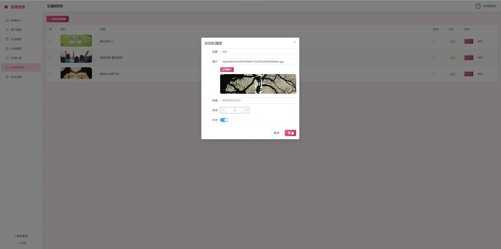
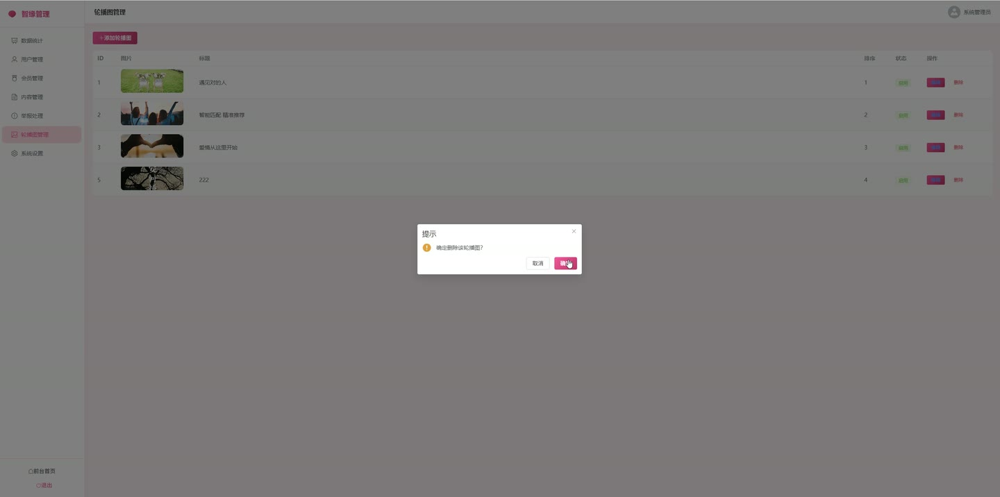

# (附文档)Springboot3+Vue3+MySQL 相亲系统

**技术栈**：Springboot3、Vue3、MySQL

### 系统简介

本系统是一套基于 Spring Boot 3 + Vue 3 + MySQL 构建的相亲交友平台，采用前后端分离架构。系统包含普通用户端与管理员端两大角色，支持用户注册登录、个人资料管理、智能匹配、即时聊天、动态发布与互动、收藏关注、举报反馈等核心婚恋社交功能，同时提供管理员后台进行用户管理、动态审核、举报处理、轮播图配置及系统设置。
 
### 核心功能
 
### 普通用户端

 
- 注册新账号（校验用户名唯一性，自动设置角色为 USER、状态为启用、VIP 等级为 0） 
- 登录账号（使用用户名 + 密码，密码经 MD5 加密校验，登录后返回 JWT Token 及用户信息） 
- 查看并编辑个人资料（昵称、头像、性别、年龄、生日、身高、体重、学历、职业、收入、省/市、自我介绍、兴趣爱好等字段） 
- 修改登录密码（需验证原密码，新密码经 MD5 加密后保存） 
- 上传个人头像（上传图片文件，保存至本地 uploads 目录，返回可访问 URL 并更新用户头像字段） 
- 管理个人相册（上传照片、查看照片列表、删除指定照片） 
- 设置择偶要求（保存/更新年龄范围、身高范围、学历、省/市、收入、描述等择偶条件） 
- 搜索用户（按关键词/昵称/职业/自我介绍、性别、城市、学历、年龄范围多条件筛选，分页返回结果） 
- 智能匹配（根据当前用户性别、城市、爱好、择偶要求等维度计算匹配度分数，按分数从高到低推荐最多 10 位候选人） 
- 查看用户详情（查看任意用户的基本资料、相册照片、择偶要求，同时返回当前用户是否已收藏该用户） 
- 收藏/取消收藏用户（点击切换收藏状态，收藏列表按时间倒序展示） 
- 查看我的收藏列表（展示所有已收藏的用户信息及收藏时间） 
- 即时聊天（获取聊天列表含最后一条消息及未读数，查看与某用户的聊天历史记录，发送文本消息，标记消息为已读） 
- 发布动态（填写文字内容，可上传多张图片，动态初始状态为待审核、点赞数和评论数为 0） 
- 浏览动态列表（仅展示状态为已审核通过的动态，支持按用户筛选，分页返回动态及对应的用户信息、评论列表） 
- 点赞动态（点赞后动态点赞数 +1，若点赞者非动态作者则自动发送通知） 
- 评论动态（发表评论后动态评论数 +1，若评论者非动态作者则自动发送通知） 
- 删除自己的动态（仅允许删除本人发布的动态） 
- 查看通知列表（展示系统通知、聊天消息提醒、动态互动通知等，按时间倒序排列） 
- 查看未读通知数量、标记单条通知为已读、一键全部标记为已读 
- 提交举报（选择被举报用户、举报原因、举报类型，提交后状态为待处理）
 
### 管理员端

 
- 查看系统统计数据（总用户数、男女用户数、VIP 用户数、今日新增用户数、动态总数、待处理举报数） 
- 管理用户列表（按关键词/用户名/昵称/手机号搜索、按状态筛选，分页展示，支持禁用/启用用户、设置 VIP 等级、删除用户、重置密码为 123456） 
- 管理动态列表（查看所有动态及发布用户，按审核状态筛选，支持审核通过/不通过，审核后自动发送通知给动态作者） 
- 管理举报列表（按处理状态筛选，查看举报详情及举报人信息，支持处理举报并填写处理结果，处理后自动发送通知给举报人） 
- 管理轮播图（查看轮播图列表，按排序字段正序排列；新增轮播图设置标题、图片 URL、链接 URL、排序、状态；编辑或删除轮播图；上传轮播图图片） 
- 管理系统设置（查看所有系统配置项，支持修改指定配置项的键值）
 
### 技术栈

 后端框架Spring Boot 3 ORMMyBatis-Plus（含分页插件、自动填充、逻辑删除） 权限认证JWT（jjwt） + 自定义拦截器 AuthInterceptor 前端框架Vue 3（Composition API + ） 状态管理Pinia（userStore） 路由Vue Router 4（createWebHistory） UI 组件库Element Plus 构建工具Vite 数据库MySQL 8 文件上传MultipartFile 本地存储（uploads 目录） 工具库Hutool（MD5 加密）、Lombok
 
### 交付内容

 
- 后端完整源码 
- 前端完整源码 
- 数据库初始化脚本 
- 万字文档

## 界面展示

---

## 获取完整源码 + 万字文档

本仓库为项目介绍页。**完整前后端源码、数据库初始化脚本、万字项目文档**，请加微信 `kangkangcode`，或访问 [codekk.top](http://codekk.top) 获取。

可作课程设计 / 毕业设计参考，支持远程部署调试。